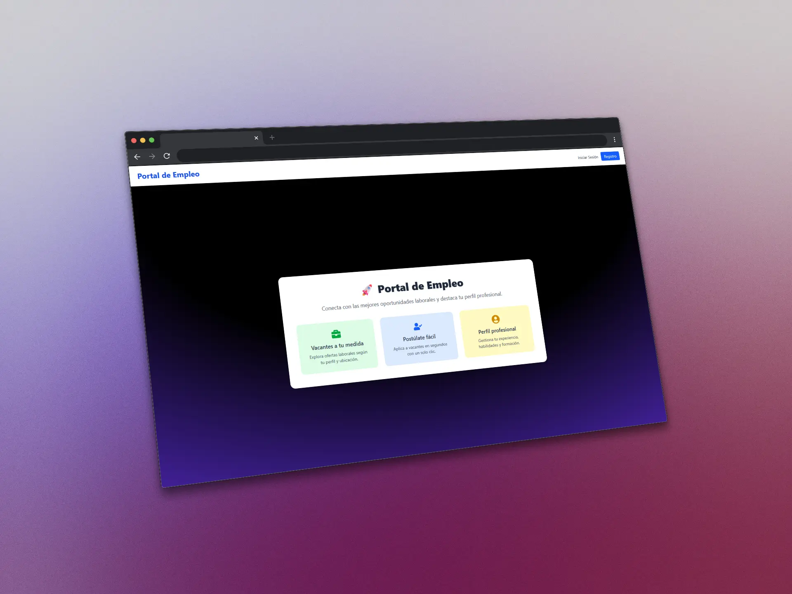
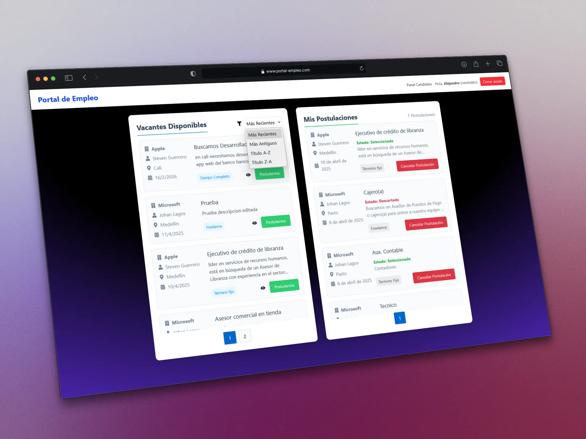
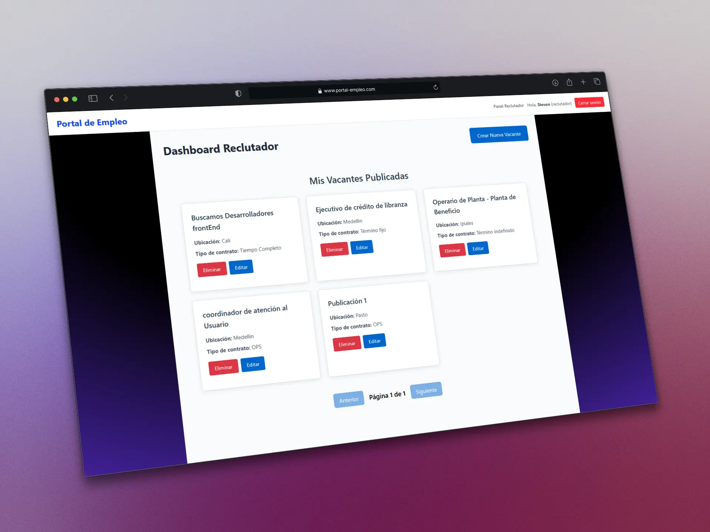

# Portal de Empleo

Portal de empleo una plataforma que facilita la busqueda de empleo y contratacion con reclutadores y candidatos. El sistema permite a las empresas publicar vacantes y a los candidatos postularse a una vacante, con gestión completa de perfiles y seguimiento de postulaciones.

## 📸 Capturas de Pantalla

### Página Principal


### Dashboard Candidato


### Dashboard Reclutador


## Características Principales

### Gestión de Usuarios
- **Registro de Usuarios**: Sistema de registro con roles (Candidato/Reclutador)
- **Perfiles Especializados**: Perfiles diferenciados según el rol del usuario
- **Autenticación JWT**: Sistema seguro de autenticación con tokens
- **Validación de Contraseñas**: Validación robusta de seguridad de contraseñas cifradas

### Gestión de Vacantes
- **Publicación de Vacantes**: Los reclutadores pueden crear y gestionar vacantes
- **Búsqueda Avanzada**: Filtros por categoría, ubicación y tipo de contrato
- **Estados de Vacantes**: Control de estados (activa/inactiva)
- **Vista Personalizada**: Los reclutadores ven solo sus vacantes publicadas

### Sistema de Postulaciones
- **Postulación Simple**: Los candidatos pueden postularse con un clic
- **Seguimiento de Estados**: Estados de un candidato durante el proceso de selección (en revisión/descartado/seleccionado)
- **Historial Completo**: Registro de todas las postulaciones realizadas
- **Gestión para Reclutadores**: Panel completo para gestionar postulantes

### Perfiles de Usuario
- **Perfil Candidato**: Información completa incluyendo experiencia, formación y habilidades
- **Perfil Reclutador**: Datos de empresa y cargo del reclutador
- **Actualización de Datos**: Los usuarios pueden mantener su información actualizada

## Arquitectura del Sistema

### Backend
- **Django 5.2**: Framework web principal
- **Django REST Framework**: API RESTful completa
- **SQLite**: Base de datos para desarrollo
- **JWT**: Autenticación basada en tokens
- **CORS**: Configuración para comunicación con frontend

### Base de Datos
- **SQLite**: Motor de base de datos ligero para desarrollo
- **Modelos Principales**:
  - `Usuario`: Modelo personalizado que extiende AbstractUser
  - `Vacante`: Gestión de ofertas de empleo
  - `Postulacion`: Registro de postulaciones
  - `PerfilCandidato`: Información detallada de candidatos
  - `PerfilReclutador`: Información de empresas

### Frontend
- **React 19**: Biblioteca principal de UI
- **Vite**: Herramienta de construcción rápida
- **TailwindCSS 4.1.3**: Framework CSS para diseño moderno con utilidades de primera clase
- **Axios**: Cliente HTTP para comunicación con API
- **React Toastify**: Notificaciones para el usuario
- **React Router**: Navegación entre páginas
- **PostCSS**: Procesamiento de CSS con TailwindCSS

## Requisitos

- Python 3.12+
- Node.js 18+
- npm o yarn

## Instalación y Ejecución

### 1. Clonar el Repositorio
```bash
git clone https://github.com/tu-usuario/JobConnect-Portal.git
cd JobConnect-Portal
```

### 2. Configurar Backend
```bash
# Crear entorno virtual
python -m venv venv

# Activar entorno virtual (Windows)
venv\Scripts\activate

# Instalar dependencias
pip install -r requirements.txt

# Realizar migraciones
python manage.py makemigrations
python manage.py migrate

# Crear superusuario (opcional)
python manage.py createsuperuser

# Iniciar servidor backend
python manage.py runserver
```

### 3. Configurar Frontend
```bash
# Navegar al directorio del frontend
cd portal-empleo-frontend

# Instalar dependencias (incluye TailwindCSS 4.1.3)
npm install

# Configuración de TailwindCSS
# El proyecto incluye:
# - tailwind.config.js: Configuración principal con rutas de contenido
# - postcss.config.cjs: Configuración de PostCSS para TailwindCSS
# - index.css: Importación de estilos y componentes personalizados

# Iniciar servidor de desarrollo
npm run dev
```

### 4. Acceder a la Aplicación
- **Backend API**: http://localhost:8000/api/
- **Frontend**: http://localhost:5173
- **Documentación API**: http://localhost:8000/api/docs/

## Flujo de Uso

### Para Candidatos
1. Registrarse como candidato en la plataforma
2. Completar perfil con información profesional
3. Explorar vacantes disponibles
4. Postularse a las vacantes de interés
5. Seguir el estado de las postulaciones

### Para Reclutadores
1. Registrarse como reclutador
2. Completar información de la empresa
3. Publicar nuevas vacantes
4. Revisar postulantes recibidos
5. Gestionar estados de las postulaciones
6. Contactar candidatos seleccionados

### Panel de Administración
- Gestión completa de usuarios y vacantes
- Estadísticas de uso del sistema
- Control de estados y moderación

## Endpoints Principales de la API

### Autenticación
- `POST /api/auth/register/` - Registro de usuarios
- `POST /api/auth/login/` - Inicio de sesión
- `GET /api/auth/profile/` - Obtener perfil de usuario

### Vacantes
- `GET /api/vacantes/` - Listar vacantes
- `POST /api/vacantes/` - Crear vacante
- `GET /api/vacantes/{id}/` - Detalle de vacante
- `PUT /api/vacantes/{id}/` - Actualizar vacante

### Postulaciones
- `GET /api/postulaciones/` - Listar postulaciones
- `POST /api/postulaciones/` - Crear postulación
- `GET /api/postulaciones/{id}/` - Detalle de postulación
- `PUT /api/postulaciones/{id}/` - Actualizar estado

## Características Técnicas

### Seguridad
- Autenticación JWT con tokens seguros
- Validación de contraseñas robusta
- CORS configurado para producción
- Protección contra CSRF

### Validaciones
- Validación de email único
- Validación de username único
- Validación de fuerza de contraseña
- Validación de datos de perfiles


## 👨‍💻 Desarrollado por

Steven Guerrero - Ingeniero de Sistemas
